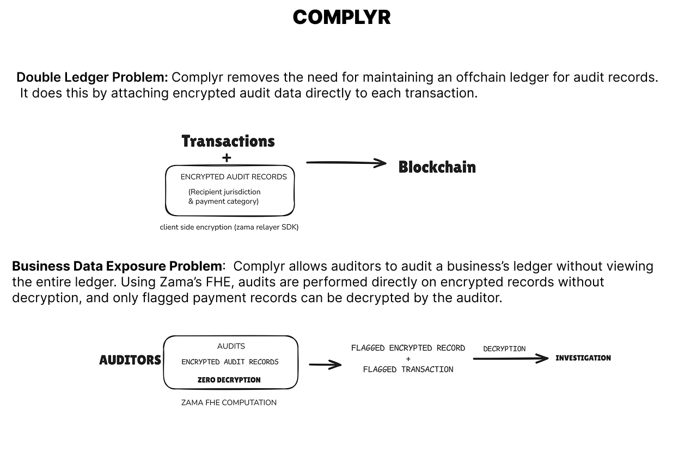

<div align="center">


# Complyr

### Business payments with a built-in private audit layer.

<br />

[](https://usecomplyr.vercel.app)
[](https://usecomplyr.vercel.app/docs)

<br />


</div>

---

## What is Complyr

Complyr is a private audit infrastructure for onchain business payments.

Every payment made through Complyr permanently attaches encrypted audit records (such as the expense category and jurisdiction) directly to the transaction. External auditors can run active compliance tests against these records without them ever being decrypted. By evaluating audit logic directly on encrypted data, the auditor gets the answers they need while the business's sensitive payment details remain completely private.

This is made possible by **Zama's Fully Homomorphic Encryption (FHE)**. FHE allows computation on encrypted data without decrypting it first. Complyr leverages this technology to turn passive encrypted storage into an active, private audit engine.

---

## The problem it solves

<div align="center">
  
</div>

<br />

Onchain businesses face two core challenges when trying to maintain compliance and privacy simultaneously.

**The Double Ledger Problem**
A blockchain transaction records who received funds and how much, but it does not record *why*. To maintain compliance, businesses are forced to maintain a separate, offchain ledger (like a spreadsheet) to track whether a payment was a contractor payout, a vendor invoice, or payroll. This creates a disconnected audit trail that is manually reconciled and easily disputed. Complyr solves this by attaching encrypted audit records directly to the onchain transaction, removing the need for an offchain ledger entirely.

**The Business Data Exposure Problem**
When a business is audited, the conventional approach requires handing over the entire ledger. This exposes sensitive information about every single transaction, including those that are completely legitimate and irrelevant to the audit. Complyr solves this by allowing auditors to review a business's ledger without ever viewing the full ledger in plaintext. Using Zama's FHE, compliance tests are performed directly on encrypted records. The auditor only ever decrypts the specific payment records that are flagged for violating a rule.

---

## How FHE makes it work

When a business sends a payment, the expense category and jurisdiction are encrypted in the browser using the Zama relayer SDK before the transaction is submitted. The plaintext values never leave the client. What is stored onchain are FHE ciphertexts that authorized wallets can decrypt, and that the contract can compute over directly. This ensures the audit records are permanent, immutable, and co-located with the transaction record.

> **Important Note:** The actual payment transactions on Complyr are public and are **not** encrypted. What gets encrypted are the specific **audit records** (such as expense categories and jurisdictions) that accompany each payment to enable private compliance checks.

### The Auditor Portal

The Auditor Portal is a dedicated interface for compliance teams, external auditors, and regulators. Once a business grants an auditor access and shares the portal URL, they use this portal to interact with the encrypted ledger. It serves as the control center where auditors can deploy active audit tests, view triggered findings, and securely decrypt the specific payment records that require investigation, all without ever exposing the company's full plaintext ledger.

### Active Audit Tests

At the core of the auditor portal are active compliance rules, known internally in the contract as `ReviewTests`. For clarity, we will refer to them as Audit Tests. An auditor can define limits against encrypted financial activity, allowing the smart contract to act as an automated Audit engine.

#### 1. Test Creation and Privacy
An auditor creates a test by setting an exposure limit (for example, a maximum spend amount) via the portal. Before this limit ever touches the blockchain, the Zama relayer SDK encrypts it directly in the auditor's browser. 

The privacy model here is strict:
*   **The Business** cannot see the auditor's limits, meaning they cannot split payments to intentionally evade detection.
*   **The Public** sees only encrypted activity and cannot determine recipient's jurisdiction, categories, or the auditor's rules.
*   **The Auditor** does not see the plaintext ledger unless explicitly granted full access. If they only have findings access, they simply receive only the flagged records which they can decrypt and further investigate.

#### 2. The Four Types of Audit Tests
The contract supports four types of tests to evaluate risk and exposure.

**Large Payment Tests**
Flags any single transaction that strictly exceeds a defined limit. 
```solidity
// LargePayment evaluation
FHE.gt(amount, test.threshold) // compares the encrypted amount to the encrypted limit
```

**Recipient Exposure Tests**
Monitors the cumulative total paid to a specific recipient address. The contract aggregates payments over time and triggers a finding if the running total crosses the auditor's limit.
```solidity
// RecipientExposure evaluation
FHE.gt(_recipientTotals[proxyAccount][recipient], test.threshold)
```

**Category Exposure Tests**
Tracks overall spending across specific business categories (e.g., Contractor payouts or Bonuses). 
*Example: "Alert me if the total combined spending for bonuses ever crosses $20,000."*
*   Payment 1: $4,000 to bonus -> (Running Total: $4,000) -> No alert.
*   Payment 2: $8,000 to bonus -> (Running Total: $12,000) -> No alert.
*   Payment 3: $12,000 to bonus -> (Running Total: $24,000) -> **ALERT!**
```solidity
// CategoryExposure evaluation
ebool isCategory = FHE.eq(category, test.numericScope);
ebool triggered = FHE.and(
    isCategory, 
    FHE.gt(_categoryTotals[proxyAccount][test.numericScope], test.threshold)
);
```

**Jurisdiction Exposure Tests**
Functions exactly like the category test, but tracks aggregate spending within a specific jurisdiction.
```solidity
// JurisdictionExposure evaluation
ebool isJurisdiction = FHE.eq(jurisdiction, test.numericScope);
ebool triggered = FHE.and(
    isJurisdiction, 
    FHE.gt(_jurisdictionTotals[proxyAccount][test.numericScope], test.threshold)
);
```

#### 3. Execution Workflow: The "Blind Accumulation" Problem

Tracking cumulative exposure on a public blockchain usually destroys privacy. If a business makes a payment and the public sees the "Bonus" running total increase, they instantly know the payment was a bonus. 

To solve this, Complyr updates *every single category and jurisdiction total at the exact same time*. When a new payment comes in, the contract uses `FHE.select` to add the real encrypted amount to the correct category, and a completely encrypted `$0` to all the other categories. Observers see every total update simultaneously with ciphertext, making it mathematically impossible to tell which category actually received the funds.

Tests evaluate in two modes:
*   **Real-time**: The contract runs active tests automatically against every new payment.
*   **Historical Backtesting**: Auditors can deploy a new limit today and instruct the contract to evaluate it against the entire historical ledger.

#### Appendix: Data Mappings
For reference, the system maps plaintext UI categories to numeric IDs onchain.

**Categories:**
`1`: Payroll (W2) | `2`: Payroll (1099) | `3`: Contractor | `4`: Bonus | `5`: Invoice | `6`: Vendor | `7`: Grant | `8`: Dividend | `9`: Reimbursement | `10`: Other

**Jurisdictions:**
`1`: US-CA | `2`: US-NY | `3`: US-TX | `4`: US-FL | `5`: US-OTHER | `6`: UK | `7`: EU-DE | `8`: EU-FR | `9`: EU-OTHER | `10`: NG | `11`: SG | `12`: AE | `13`: OTHER

---

## Architecture

```
┌──────────────────────────────────────────────────────────────────────┐
│                           Next.js Web App                            │
│  Privy auth · ERC-4337 client · payment UI · auditor portal         │
│  Zama browser encryption · docs                                      │
└───────────────┬───────────────────────────────┬──────────────────────┘
                │                               │
                │ UserOperations, reads         │ GraphQL queries
                ▼                               ▼
┌──────────────────────────────────┐   ┌──────────────────────────────┐
│        Ethereum Sepolia          │   │         Envio Indexer        │
│ SmartWallet (ERC-4337)           │   │ Wallet / Transaction / Intent│
│ SmartWalletFactory               │   │ derived read model           │
│ IntentRegistry                   │   └──────────────────────────────┘
│ AuditRegistry (FHE core)         │
│ MockUSDC                         │
└───────────────┬──────────────────┘
                │ app-owned data
                ▼
┌──────────────────────────────────┐
│ PostgreSQL via Drizzle ORM       │
│ contacts                         │
└──────────────────────────────────┘
```

The FHE logic is concentrated in `AuditRegistry.sol`. It stores encrypted ledger entries, maintains encrypted running totals by recipient, category, and jurisdiction, manages auditor access levels with `FHE.allow`, and evaluates private audit tests against encrypted data.

---

## Tech stack

| Layer | Technology |
|---|---|
| Chain | Ethereum Sepolia |
| FHE | Zama (`@fhevm/solidity`, `@zama-fhe/relayer-sdk`) |
| Account abstraction | ERC-4337, EntryPoint v0.7, Pimlico bundler/paymaster |
| Indexing | Envio HyperIndex + GraphQL |
| Frontend | Next.js, Tailwind CSS, shadcn/ui |
| Auth | Privy |
| Database | Neon PostgreSQL via Drizzle ORM |
| Contracts | Solidity, Foundry, OpenZeppelin |

---

## Local development

**Prerequisites:** Node.js 18+, pnpm, Foundry.

```bash
git clone https://github.com/Stoneybro/complyr
cd complyr
pnpm install
```

Create `apps/web/.env.local`:

```bash
NEXT_PUBLIC_PRIVY_APP_ID=

NEXT_PUBLIC_PIMLICO_API_KEY=
NEXT_PUBLIC_PIMLICO_SPONSOR_ID=

COMPLYR_DATABASE_URL=postgresql://...

# Ethereum Sepolia contract addresses
NEXT_PUBLIC_INTENT_REGISTRY_ADDRESS=0x...
NEXT_PUBLIC_AUDIT_REGISTRY_ADDRESS=0x...
NEXT_PUBLIC_SMART_WALLET_FACTORY_ADDRESS=0x...
NEXT_PUBLIC_MOCK_USDC_ADDRESS=0x...

# Optional: client has a default fallback
NEXT_PUBLIC_ENVIO_API_URL=https://indexer.dev.hyperindex.xyz/63b8cce/v1/graphql
```

Run the app:

```bash
pnpm dev
```

Run contract checks:

```bash
pnpm forge:build
pnpm forge:test
```

---

## Contract deployment (Ethereum Sepolia)

```bash
PRIVATE_KEY=0x... forge script packages/contracts/script/DeployAll.s.sol:DeployAll \
  --rpc-url sepolia --broadcast
```

This deploys and wires `AuditRegistry`, `SmartWallet`, `SmartWalletFactory`, `IntentRegistry`, and `MockUSDC`. After deployment, update the `NEXT_PUBLIC_*` address variables and the address placeholders in `packages/indexer/config.yaml`.

---

## Project structure

```
complyr/
├── apps/
│   └── web/                      # Next.js frontend
│       └── src/
│           ├── app/              # App router pages (dashboard, auditor portal, docs)
│           ├── hooks/payments/   # useSingleTransfer, useBatchTransfer, useRecurringPayment
│           └── lib/
│               └── fhe-audit.ts  # Zama FHE encryption and decryption functions
├── packages/
│   ├── contracts/src/
│   │   ├── AuditRegistry.sol     # FHE audit core
│   │   ├── SmartWallet.sol       # ERC-4337 business treasury wallet
│   │   ├── SmartWalletFactory.sol
│   │   ├── IntentRegistry.sol    # Recurring payment schedules
│   │   └── MockUSDC.sol
│   └── indexer/                  # Envio HyperIndex configuration
└── readme.md
```

---

## Limitations

As a proof of concept built for the Zama FHE Hackathon, the current implementation has a few intentional constraints:
- **Testnet Only:** Currently deployed on Ethereum Sepolia and not yet audited for production treasury use.
- **Auditor Revocation:** Removing an auditor revokes future access, but does not retroactively revoke all cryptographic KMS permissions for past records.
- **Narrow Enums:** Categories (10) and jurisdictions (13) are hardcoded limits for the demo.
- **Plaintext References:** Invoice numbers and reference IDs are stored in plaintext for usability, as encrypting dynamic strings is currently non-trivial in FHE.
- **No Regulatory Engine:** It provides private audit infrastructure, but does not natively enforce tax withholding or automated regulatory rules.

---

## Roadmap

- **Enable Recurring Payments:** Finalize the integration of recurring payment schedules to fully automate payroll and subscriptions.
- **Regulatory Alignment:** Improve Complyr's workflows and reporting capabilities based on strict regulatory guidelines and compliance frameworks.
- **Dynamic Payment Options:** Make Complyr more dynamic and add redundancies to accommodate diverse business methods of payment.
- **Mainnet Deployment:** Perform a formal security review of the contracts and transition to Ethereum Mainnet.
- **Zero-Knowledge Attestations:** Move from a "decrypt and inspect" model to a "prove and verify" model, allowing businesses to generate regulatory attestations without exposing raw records to auditors.

---

## Key design decisions

**Payments require audit data.** `SmartWallet.sol` intentionally disables plain transfer helpers. They revert with `SmartWallet__AuditRequired`. Every payment in Complyr carries encrypted audit context atomically. There is no bypass.

**Audit thresholds are encrypted end-to-end.** Auditor test criteria are encrypted in the auditor's browser before submission. The business is never granted `FHE.allow` on threshold ciphertexts and cannot read the auditor's rules.

**Findings are masked when not triggered.** `AuditRegistry` stores findings using `FHE.select(triggered, value, asEuint(0))`. An auditor who decrypts a non-triggered finding receives zeros. No information about payments that did not meet the criteria is ever revealed.

**Reference IDs remain plaintext.** Amounts, categories, and jurisdictions are encrypted. Reference IDs (invoice numbers, payroll batch IDs) are stored as plaintext strings, a deliberate usability tradeoff that allows businesses to reconcile onchain records against their internal accounting systems. This is a documented limitation. Encrypting variable-length strings is non-trivial with the Zama type system, which supports fixed-size numeric types only.

---

<div align="center">

Built for the [Zama FHE Hackathon](https://www.zama.ai/).

</div>
