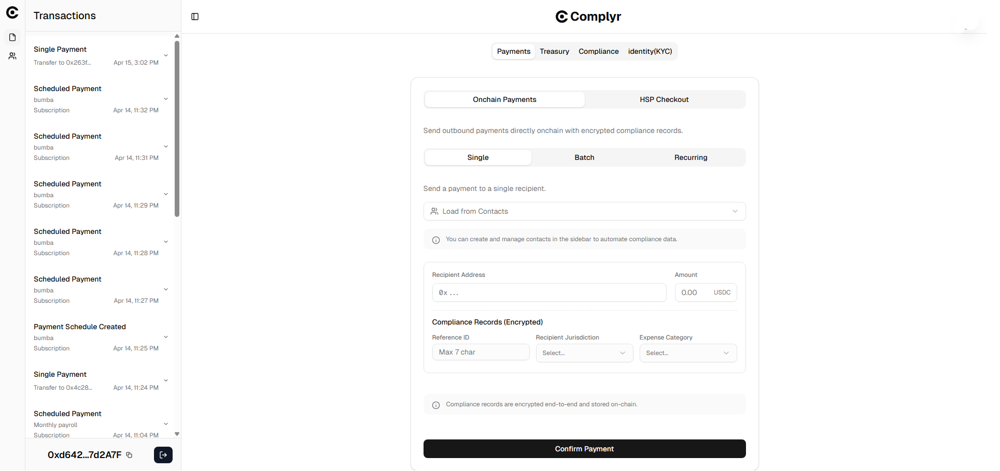

<div align="center">


# Complyr

### A business account with a dual payments engine that natively embeds encrypted compliance data into transactions for external regulators.

<br />

[](https://usecomplyr.vercel.app)
[](https://youtu.be/DXcpSvD3kkA?si=6G-i6YwNF229ETro)
[](https://usecomplyr.vercel.app/docs)

<br />


</div>

---

> **For judges and reviewers:** This README covers the highlights. The full product documentation — architecture deep-dive, smart contract reference, encryption flow, auditor portal design, known limitations, and roadmap — is written up at **[usecomplyr.vercel.app/docs](https://usecomplyr.vercel.app/docs)**. Worth a look if you want to understand the full system.

## Executive summary (easy read)

Complyr is a compliance intelligence layer for business payments on HashKey Chain.

It solves one core gap: blockchains record **value transfer** (`who` and `how much`) but not business **compliance intent** (`why this payment was made`, `jurisdiction`, `category`, `reference`).

Complyr makes this intent audit-ready by:

- attaching encrypted compliance metadata to payment flows,
- preserving privacy on-chain,
- and enabling controlled auditor access when needed.

This works across:

- **Outbound payments** (single, batch, recurring treasury flows), and
- **Inbound payments** via **HSP checkout**, which provides controlled metadata capture before settlement.

---

## HashKey integrations (highlight)

Complyr intentionally integrates multiple HashKey ecosystem products:

1. **HashKey KYC SBT**
   - Reads recipient KYC status and level on-chain (Basic → Ultimate).
   - Uses these identity signals to guide payment decisions and reporting context.

2. **HashKey Settlement Protocol (HSP)**
   - Powers controlled checkout flows for incoming payments.
   - Closes the inbound metadata gap that normally exists in direct on-chain transfers.

3. **APRO Oracle (USDC/USD)**
   - Adds verifiable USD valuation to treasury and compliance reporting.
   - Improves audit and tax reconciliation quality.

---

## Demo

<div align="center">

[](https://youtu.be/DXcpSvD3kkA?si=6G-i6YwNF229ETro)

*▶ Click to watch the demo*

</div>

---

## The problem

Blockchain payments faithfully record *who* was paid and *how much*. They say nothing about *why*.

In a traditional business, you can't just send money without a paper trail. Tax authorities and auditors require proof of *what* you paid for and *where* the recipient is located. If you pay $2,000 to a contractor and $500 for software, you need to document that these were legitimate business expenses. If you don't, you face huge tax penalties. 

This problem exists for both sending money (payouts) and receiving money (e-commerce).

Today, crypto wallets completely ignore this. The payment executes, but the compliance data is missing. Companies are forced to manually copy-paste their crypto history into off-chain accounting software, which is tedious, error-prone, and defeats the purpose of an automated blockchain.

**Complyr solves the missing "why."** Whenever you send or receive money, Complyr automatically attaches an encrypted "receipt" (showing the expense category, tax jurisdiction and reference id) directly to the transaction. Your business data stays completely private on the blockchain, but can be decrypted by your trusted auditors whenever needed.

---

<div align="center">



*The Complyr wallet dashboard — Payments, Treasury, and Compliance in one view.*

</div>

## How it works: The Dual Payment Engine

Complyr operates as a unified business account powered by a **dual payment engine** designed for HashKey Chain. Both engines automatically route through the AES-256 compliance layer.

**Important context:** Complyr is primarily built for **outbound treasury payments**. HSP extends this model to **inbound checkout payments**, so incoming funds can carry structured compliance records too.

### 1. Treasury / Outbound (Paying Employees & Vendors)
You use the Complyr dashboard just like a smart treasury to send one-off payments, run batch payroll, or set up recurring subscriptions. 

Behind the scenes, it's powered by an advanced Smart Wallet account. Before the payment is sent, your compliance data (like "Contractor" + "US-California"+ "INV-001") is encrypted directly in your browser. This encrypted record is stored on the blockchain right next to the payment, meaning your private business data is never exposed to the public. All transactions are gasless.

### 2. Checkout / Inbound (Getting Paid by Customers)
When you want to sell a product, you create a hosted checkout link using the **HashKey Settlement Protocol (HSP)**. 

When your customer clicks the link and pays, Complyr automatically pairs their payment with their predefined tax rules. The customer gets a smooth, normal e-commerce experience, and you instantly get a completed compliance record in your dashboard.

Without this checkout layer, incoming funds can arrive as plain transfers with no structured business context. HSP gives Complyr a controlled intake path, making inbound records auditable like outbound treasury records.

```
User initiates payment (Onchain Treasury) OR generates HSP Checkout link
          │
          ▼
Compliance metadata encrypted client-side via AES-256-GCM (runs in-browser)
          │
          ├─────────────────────────────────────────────────────────────────┐
          ▼                                                                 ▼
  HashKey Chain                                                 HashKey Chain
  Payment executes via ERC-4337 smart wallet                    Ciphertext submitted to ComplianceRegistry
  Gasless — sponsored by VerifyingPaymaster                     TxHash linked to encrypted blob
                                                                ACL access granted via ECIES
```

### How HashKey KYC SBT guides payments

Before or during payment workflows, Complyr reads the recipient's KYC credential from HashKey KYC SBT.

- Verified recipients are surfaced with their KYC level.
- Unverified recipients are clearly flagged.
- The same KYC signal is available in compliance reporting views.

This helps businesses apply identity-aware controls before funds are sent, instead of discovering risk only after settlement.

---

## Architecture

Complyr is built natively on HashKey Chain Testnet, divided across three distinct layers.

### Layer 1 — Smart contracts on HashKey Chain

**`SmartWallet`** is an ERC-4337 compliant smart account, deployed as a minimal proxy clone per business entity via `Clones.cloneDeterministic`. The address is deterministic, enabling counterfactual wallets and gasless `initCode` deployment. The wallet maintains two fund states: *available balance* and *committed balance*. When a recurring payment intent is created, the full expected commitment is locked — preventing those funds from being spent elsewhere. All transactions are fully gasless, sponsored through a self-hosted Skandha bundler on Railway.

**`SmartWalletFactory`** deploys and tracks smart wallet clones, one per user identity. Uses the owner address as the deterministic salt. Pre-funded to drip `100 HSK` to each newly deployed wallet, making testnet onboarding frictionless. Designed to trigger automatic company registration on the Compliance Registry at wallet creation.

**`IntentRegistry`** is the scheduling and compliance dispatch engine for the Onchain Treasury. It manages the full intent lifecycle: creation, recurring execution, and cancellation with automatic fund release. Key design decisions:
- Validates fund availability before locking (`totalAmountPerCycle × totalCycles`)
- Implements the Chainlink Automation interface (`checkUpkeep` / `performUpkeep`), polled by a custom keeper every 30 seconds.
- Skip-on-fail execution: if a recipient transfer fails, the amount is recorded in `intent.failedAmount` for recovery, and execution continues for remaining recipients.

**`ComplianceRegistry`** is the core privacy-preserving storage contract. It maintains an isolated compliance ledger per company. Each record stores:
- `txHash` — deterministic link to the HashKey transaction or intent ID
- `recipients[]` and `amounts[]` — plaintext (already public on the payment ledger).
- `encryptedPayload` — AES-256-GCM ciphertext containing the expense categories, jurisdictions, and reference IDs.
- `timestamp` — block timestamp at record creation

**`VerifyingPaymaster`** unconditionally sponsors all user operations on testnet, making the UX fully gasless for outbound operations.

---

### Layer 2 — Data indexing via Envio

A custom Envio indexer listens to all relevant events on HashKey Chain and normalises them into typed `Transaction` entities with structured JSON details, exposed via a hosted GraphQL API. The schema and handlers are written specifically for Complyr — not generated from a template. Coverage includes: wallet creation, single transfers, batch transfers, intent creation, scheduled payment execution, intent cancellation, transfer failures, and HSP Checkout settlements. A helper `Intent` entity stores configuration from `IntentCreated` events so that execution handlers can reconstruct recipient and amount data.

---

### Contact book

Complyr includes a built-in recipient address book backed by Neon PostgreSQL via Drizzle ORM. Companies save recipient addresses alongside their compliance defaults — preferred jurisdiction and expense category — so that recurring payment counterparties never require re-entering compliance metadata. When a saved contact is selected in the payment form, the jurisdiction and category fields are pre-populated automatically.

---

## Compliance model

Complyr captures three encrypted dimensions per recipient per payment, stored as AES ciphertext.

**Jurisdiction**

| Value | Label |
|---|---|
| 1 | US — California |
| 2 | US — New York |
| 3 | US — Texas |
| 4 | US — Florida |
| 5 | US — Other |
| 6 | United Kingdom |
| 7 | Germany |
| 8 | France |
| 9 | Other EU |
| 10 | Nigeria |
| 11 | Singapore |
| 12 | UAE |
| 13 | Other |

**Category**

| Value | Label |
|---|---|
| 1 | Payroll (W2) |
| 2 | Payroll (1099) |
| 3 | Contractor |
| 4 | Bonus |
| 5 | Invoice |
| 6 | Vendor |
| 7 | Grant |
| 8 | Dividend |
| 9 | Reimbursement |
| 10 | Other |

The third is a reference ID determined by the business

**Trust model:** Complyr enforces three properties of every compliance record — **existence** (created at the time of the payment), **immutability** (cannot be altered or deleted), and **cryptographic linkage** (permanently tied to the underlying transaction). It does not enforce the accuracy of the metadata a company submits. Businesses self-report their categories and jurisdictions, consistent with how traditional accounting works. What Complyr makes unfakeable is the record's presence, its link to the payment, and the fact that it was committed at transaction time.

---

## Auditor portal & ECIES Key Management

<div align="center">


*External auditor portal — ACL-gated decryption of compliance records.*

</div>

Companies share a unique portal URL — `/auditor/{proxyAddress}` — with any external party such as a regulator, accountant, or tax authority.

**The Simple Flow:**
1. The business owner or accountant using Complyr explicitly permits an external auditor wallet address.
2. They generate a secure dedicated auditor portal link and share it with the auditor.
3. The auditor navigates to the dedicated portal, connects their authorized wallet, and is immediately granted access.
4. The auditor can view the plaintext logs of all records and download fully filtered CSV tax reports, without ever having log-in access to the company's actual bank account.

**Under the Hood (ECIES Key Management):**
This system is powered by cryptography, not traditional software access controls. When the business authorizes the auditor, their browser takes the company's master AES compliance key and securely encrypts it using the auditor's *public* Ethereum key (ECIES), storing this wrapped key on the HashKey Chain registry. 

When the auditor logs into the portal, their browser uses their wallet's *private* key to decrypt the AES key client-side. With the AES key recovered, the auditor's browser fetches the ciphertext payloads from the blockchain and decrypts them locally. 

Auditors can see all plaintext payment metadata, decrypted expense categories per recipient, decrypted regulatory jurisdictions per recipient, and compliance summary statistics. They cannot modify records, authorise additional parties, or access any data beyond what was explicitly delegated to them.

---

## Feature overview

| Feature | Status |
|---|---|
| Dual Payment Engine (Onchain Treasury + HSP Checkout) | ✅ Live (HSP in simulated mode for demo credentials) |
| Single & Batch HashKey transfers with compliance metadata | ✅ Live |
| Recurring payments / payroll scheduling | ✅ Live |
| HashKey KYC SBT recipient status + level checks | ✅ Live |
| Client-side AES-256-GCM encryption | ✅ Live |
| Auditor Access Control via ECIES Key Wrapping | ✅ Live |
| Selective decryption via external auditor portal | ✅ Live |
| Compliance health dashboard | ✅ Live |
| Filterable CSV tax report export | ✅ Live |
| Contact book with pre-attached compliance metadata | ✅ Live |
| Gasless UX (ERC-4337 + VerifyingPaymaster) | ✅ Live |
| Social login (Google, GitHub, Email via Privy) | ✅ Live |
| Custom Envio indexer + GraphQL activity feed | ✅ Live |

---

## Tech stack

| Layer | Technology |
|---|---|
| Payment execution | HashKey Chain, ERC-4337, HashKey Settlement Protocol (HSP) |
| Bundler | Self-hosted Skandha (Railway) |
| Privacy layer | AES-256-GCM Client-side encryption, ECIES key management |
| Automation | Custom keeper (Railway, 30s poll interval) |
| Indexing | Envio HyperIndex, custom schema |
| Frontend | Next.js 16, Tailwind CSS v4, shadcn/ui |
| Auth + embedded wallets | Privy |
| Database | Neon PostgreSQL via Drizzle ORM (contacts only) |
| Smart contracts | Solidity ^0.8.19 / ^0.8.24 (compiled with 0.8.28), Foundry, OpenZeppelin |

---

## Run locally

**Prerequisites:** Node.js 18+, pnpm, Foundry

```bash
git clone https://github.com/Stoneybro/complyr
cd complyr
pnpm install
```

Create `apps/web/.env.local`:

```bash
# Privy authentication
NEXT_PUBLIC_PRIVY_APP_ID=your_privy_app_id

# Neon PostgreSQL — for the contact book feature
COMPLYR_DATABASE_URL=postgresql://...

# Envio GraphQL API
NEXT_PUBLIC_ENVIO_API_URL=https://indexer.dev.hyperindex.xyz/86c2f35/v1/graphql
```

```bash
pnpm dev          # Web app at localhost:3000
pnpm forge:build  # Compile HashKey Chain contracts
pnpm forge:test   # Run contract tests
```

To run the keeper locally:

```bash
cd packages/keeper
cp .env.example .env   # Fill in PRIVATE_KEY and RPC_URL
pnpm dev               # Polls IntentRegistry every 30 seconds
```

---

<div align="center">

Built for the **HashKey Chain Horizon Hackathon**

*Dual Payment Engine · Encrypted compliance · Selective auditing*

</div>
